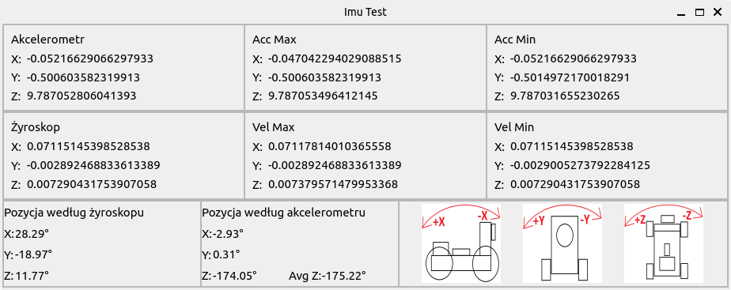

# Imu test from ros2 gazebo:



# Download

Aby pobrać wymagane biblioteki użyj komendy:

```
pip install PyQt5 numpy
```

# Run

Aby uruchomić aplikację należy użyć komendy:

```
python main.py
```
